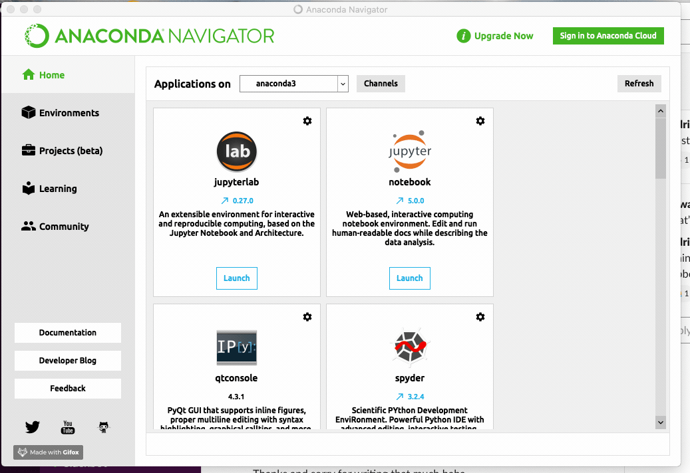
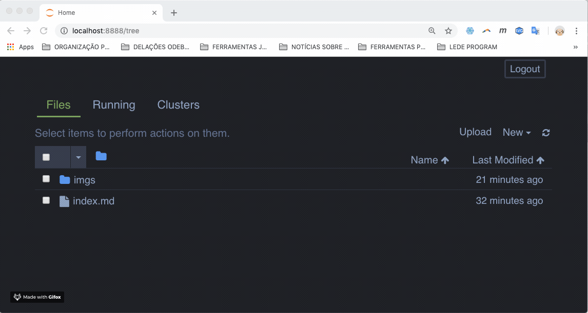
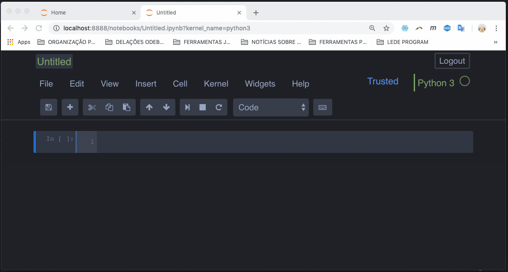

# Uma breve introdução ao Python

Na segunda aula do curso, vimos como encontrar pautas interessantes usando portais de dados abertos do governo. Mais especificamente, navegamos juntos pela base de dados que reúne todos as compras feitas com o Cartão de Pagamento do Governo Federal, os infames cartões corporativos. Entretanto, acessamos apenas um arquivo, referente ao mês de janeiro de 2019. **Mas por que ser tão modesto?**

Os programas de planilha têm limitações quanto ao tamanho dos arquivos que conseguem abrir. Com paciência, dá pra fazer coisas muito boas usando apenas eles. Entretanto, caso você queira acessar uma quantidade maior de dados de uma vez só, é uma boa hora para começar a aprender alguns truques do mundo da programação.

A maioria dos jornalistas que conheço usa uma dessas três linguagens no trabalho: **Python**, **R** e **SQL** - embora essa última não seja beeem uma linguagem de programação. No meu dia-a-dia, uso o Python para 99% das coisas, mas para meus primeiros trabalhos, usei muito SQL. Assim, vou montar breves tutoriais para esses dois, já que não entendo quase nada de R (e acho que é uma linguagem muito feia, mas isso é outra história).

- Veja também ["Uma breve introdução ao SQL"](https://rodrigomenegat.github.io/jgd-1/introducao-ao-sql)
 

## De onde começamos?

Para ser sincero, não posso chamar isso aqui de "introdução ao Python". Para isso, eu teria que passar algum tempo ensinando vocês coisas básicas como "o que é uma variável" e "o que é um bloco *if/else*". Talvez eu faça isso um dia, mas por enquanto prefiro partir de um ponto um pouco mais além. Assim, sugiro que quem quer seguir meu pequeno tutorial faça primeiro alguns módulos do ["Python's Not (Just) For Unicorns"](http://littlecolumns.com/learn/python/data-types-errors/). 

Como mencionei na [ementa](https://rodrigomenegat.github.io/jgd-1) dessa disciplina, trata-se de um curso online e gratuito que ensina o básico da linguagem. O autor, [Jonathan Soma](https://www.github.com/jsoma) foi meu professor na pós-graduação e é o cara que me ensinou a programar bem. O único problema é que o conteúdo só está disponível em inglês, mas dá para se virar bem usando o Google Translator.

Assim, a partir daqui, eu presumo que você já sabe o que é uma variável, uma *string*, um *int*, um *float* e coisas assim. Se você não sabe, bom, faça o curso! É super bem-escrito, divertido, esclarecedor – e o tema nem é tão difícil, no fim das contas.

## Anaconda

Instalar o Python geralmente é muito chato. Para driblar isso, vamos usar o [Anaconda](https://www.anaconda.com/distribution/)! É uma distribuição do Python que já inclui tudo que você precisa para brincar de cientista de dados. Acesse o link, baixe e instale a versão Python 3.7. Ah: caso o instalador te pergunte, você quer instalar o programa *só para você*.

Quando tudo estiver pronto, execute o **Anaconda Navigator**. Assim que ele carregar, você vai estar diante de um painel de controle com várias opções para fazer coisas malucas. Entretanto, o que interessa agora é apenas uma: clique em 'launch' para abrir o **Jupyer Notebook**.

## Jupyter Notebook

Se você fez o [curso do Soma](#da-onde-começamos?), está acostumado a rodar código direto no navegador. Também é possível que você esteja acostumado a salvar arquivos `.py` e executa-los a partir do terminal. Bom, aqui vamos fazer as coisas de um jeito diferente.

O [Jupyter]() é uma maneira diferente de programar, que permite que você execute o código de parte por parte sem precisar rodar tudo de uma vez do início ao fim. Isso é ótimo para o tipo de trabalho que fazemos, que envolve ver o resultado de nossas operações passo-a-passo.

O primeiro passo é criar um novo notebook.

Depois, não tem muito segredo:

Você pode inserir células de código, que são rodadas usando `SHIFT + ENTER`, e também pode adicionar células de Markdown, uma espécie de texto estruturado, para fazer comentários sobre o código.

## import pandas as pd

Uma coisa importante para saber sobre programação: provavelmente alguém já fez um programa que faz o que você precisa. Para que reinventar a roda, se podemos usar o conhecimento dos desenvolvedores que vieram antes de nós?

A ideia por trás do `import` é isso. Com esse comando, você pode importar para o seu projeto funções desenvolvidas por outras pessoas. Esses conjuntos de funções se chamam *libraries* ou *packages*.

O pacote que mais uso para meu trabalho jornalístico, sem a menor dúvida, é o **pandas**.